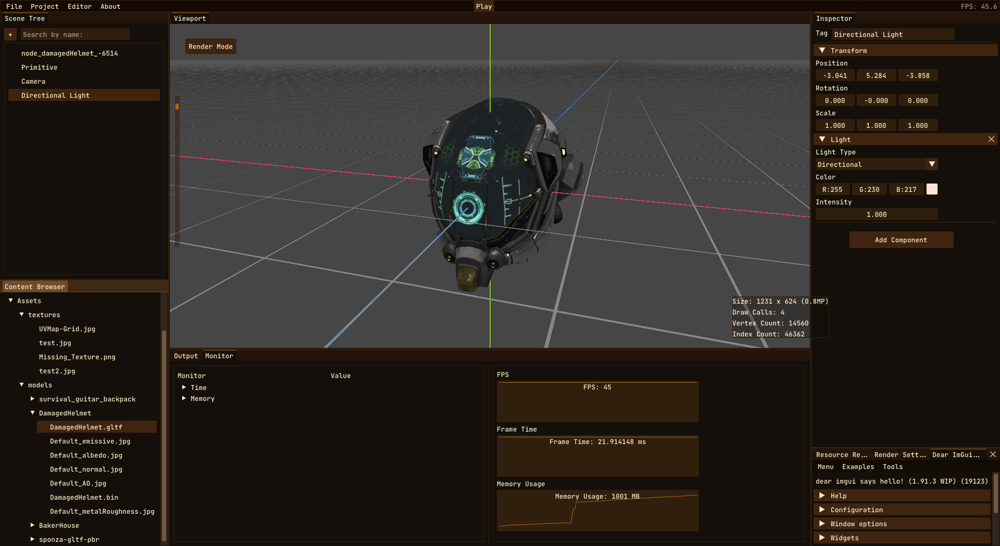

# Coffee Engine
[](https://github.com/Brewing-Team/Coffee-Engine/actions/workflows/publish-docs.yml)

<p align="center">
    
</p>

**Coffee Engine is a Beautiful and Cross-platform 3D Game Engine written in C++ using OpenGL and SDL3.** </br> 

> [!IMPORTANT]
> This is a university project for learning how to make a 3D game engine.

---

# Getting Started

Any IDE or Text Editor that supports CMake Projects (and vcpkg) should work for developing the project.

## Building

### 1. Clone the repository
```
git clone --recursive https://github.com/Brewing-Team/Coffee-Engine.git
cd Coffee-Engine
```

### 2. Compilation
<details>
  <summary>Windows</summary>
There are a lot of ways to do it. From installing all the necessary packages for building it (cmake, vcpkg, a compiler...), to using a IDE environment. My recomendation is to use an IDE environment if what you want is an straightforward way to compile the project.

#### Instructions to compile the project using an IDE

##### Visual Studio 2022
1. Open the folder with Visual Studio 2022
2. Enable vcpkg integration. More info at https://devblogs.microsoft.com/cppblog/vcpkg-is-now-included-with-visual-studio.
3. Reconfigure the cmake project. If the output panel display something like ```running vcpkg install``` then you are ready to go to the next stage.
4. Wait until all the dependencies are installed by vcpkg.
Then select on the top play button the Coffee-Editor.exe and run it.
5. Go to the "bin/Coffee-Engine/<build type>" folder
6. Congratulations! You have built Coffee-Engine for the first time!

##### CLion
1. Open the folder with CLion
2. ...
    
</details>
<details>
  <summary>Linux</summary>

#### 1. Install vcpkg

##### Clone vcpkg
```
git clone https://github.com/microsoft/vcpkg.git
cd vcpkg
```
##### Run the bootstrap
```
./bootstrap-vcpkg.sh
```

##### Enable the vcpkg instance
```
./vcpkg integrate install
```
> Sometimes this will not automatically add the VCPKG_ROOT environment variable!

##### For more info take a look at https://learn.microsoft.com/en-us/vcpkg/get_started/get-started?pivots=shell-powershell

#### 2. Build
```
mkdir build && cd build
cmake .. -DCMAKE_BUILD_TYPE=Release
make -j $(nproc) CoffeeEditor
```
#### 3. Enjoy!
```
cd ../bin/CoffeeEditor/Release
./CoffeeEditor
```
</details>

---

# Features (WIP)
> [!WARNING]
> This is outdated, please Brewing-Team update it!
- [x] Compatible with Windows and Linux.
- [x] 3D Rendering
  - [x] Textures
  - [x] Materials
  - [x] Shaders
  - [x] PBR Rendering
  - [x] Lights
  - [ ] Environment
- [x] Scene System
  - [x] Scene Tree
  - [x] ECS System
  - [x] Model Loading
- [x] Editor
- [ ] Save And Loading

---

# Screenshots





---

## Acknowledgements

This project makes use of several open-source libraries and resources that have greatly contributed to its development. Special thanks to the creators and maintainers of the following:

- **[spdlog](https://github.com/gabime/spdlog)**: Fast C++ logging library.
- **[SDL3](https://github.com/libsdl-org/SDL)**: Cross-platform development library made by [libsdl.org](https://libsdl.org/).
- **[GLM](https://github.com/g-truc/glm)**: OpenGL Mathematics library for graphics software.
- **[GLAD](https://github.com/Dav1dde/glad)**: Multi-language OpenGL loader-generator.
- **[ImGui](https://github.com/ocornut/imgui)**: Immediate Mode Graphical User Interface for C++.
- **[stb_image](https://github.com/nothings/stb)**: Image loading library.
- **[assimp](https://github.com/assimp/assimp)**: Library to import various well-known 3D model formats.
- **[EnTT](https://github.com/skypjack/entt)**: Fast and reliable entity-component system (ECS).
- **[Tracy](https://github.com/wolfpld/tracy)**: Real-time, nanosecond resolution, remote telemetry, hybrid frame and sampling profiler.
- **[LearnOpenGL](https://learnopengl.com/)**: Comprehensive OpenGL tutorial and resource site.
- **[Hazel](https://github.com/TheCherno/Hazel)**: A small game engine developed by TheCherno as part of his game engine series.
- **[Godot](https://godotengine.org/)**: An advanced, feature-packed, multi-platform 2D and 3D open-source game engine.
- **[skypjack on software](https://skypjack.github.io/)**: Blog and resources on software development by skypjack.
