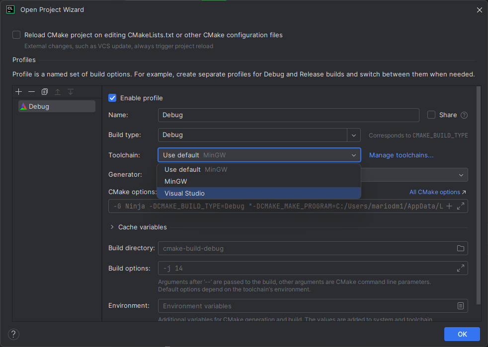
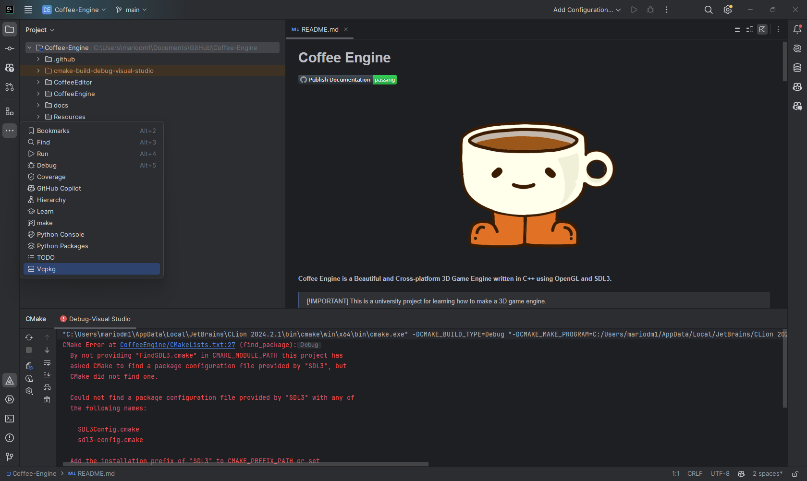
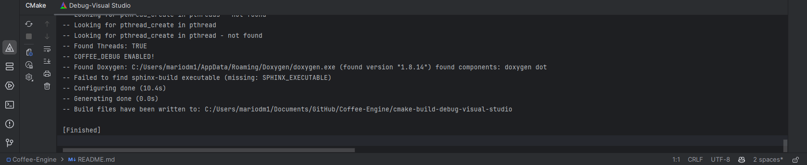
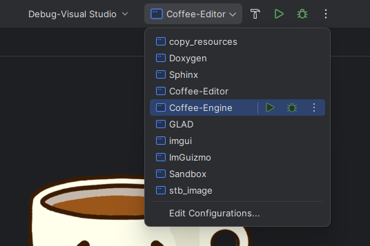
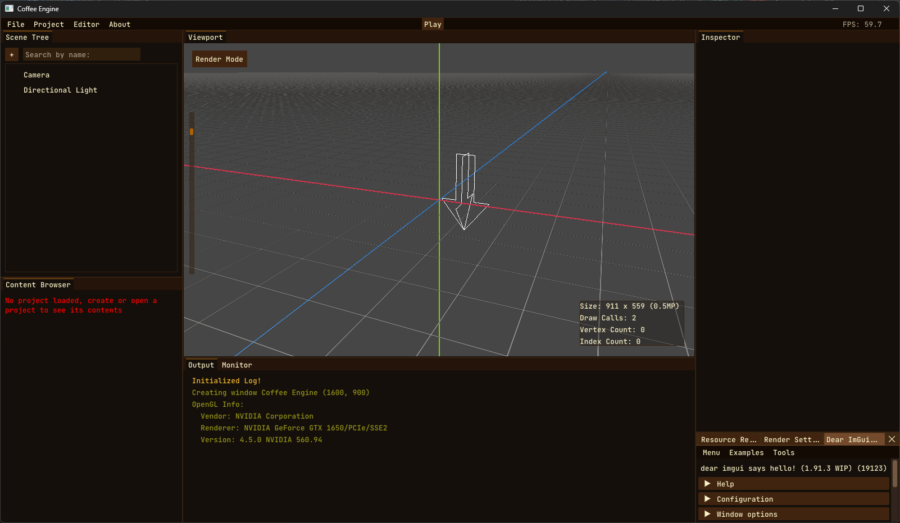

CLion
=====

`CLion <https://www.jetbrains.com/clion/>`_ is a commercial `JetBrains <https://www.jetbrains.com/>`_ IDE for C++.

Setting up the project
-----------------------------------

- First you need to clone the project from the repository. You can do this by via the command line or by using the `GitHub Desktop <https://desktop.github.com/>`_ application.

- Open CLion and select **Open** from the welcome screen or **File > Open** from the menu bar. Navigate to the project directory and open the root folder.

- It will pop up a Project Wizard dialog. Change the Toolchain field to Visual Studio to use MSVC compiler, if you have gcc or other compiler, select the one you prefer.

Then press `OK`.

- CLion will open it's default project view. You can see the project structure on the left side of the window. It's normal to see some errors in the project view, as the project is not yet configured.

- You have to open the vcpkg view in the sidebar and install the dependencies. Go to **View > Tool Windows > vcpkg** or in the sidebar just click to "..." and select vcpkg.

- When you open the vcpkg view, you will see a list of dependencies. Before installing them, you have to press the edit button and in the opened dialog, set the current profile to be integrated to vcpkg.

.. figure:: img/coffee4.png
   :align: center

- Then in the CMake tab, it will automatically start downloading the dependencies and compiling them. This process may take a while, up to 20 minutes. When the terminal shows "[Finished]", you're ready to go.

- Now you have to select the target you want to run. You can do this by clicking the target dropdown on the top right corner of the window. Select the target you want to run. In this case is Coffee-Editor.

NOTE: if the Refreshing files... step take too long, just cancel the process and launch the game again.

- Finally you can run the project by pressing the green play button on the top right corner of the window.

