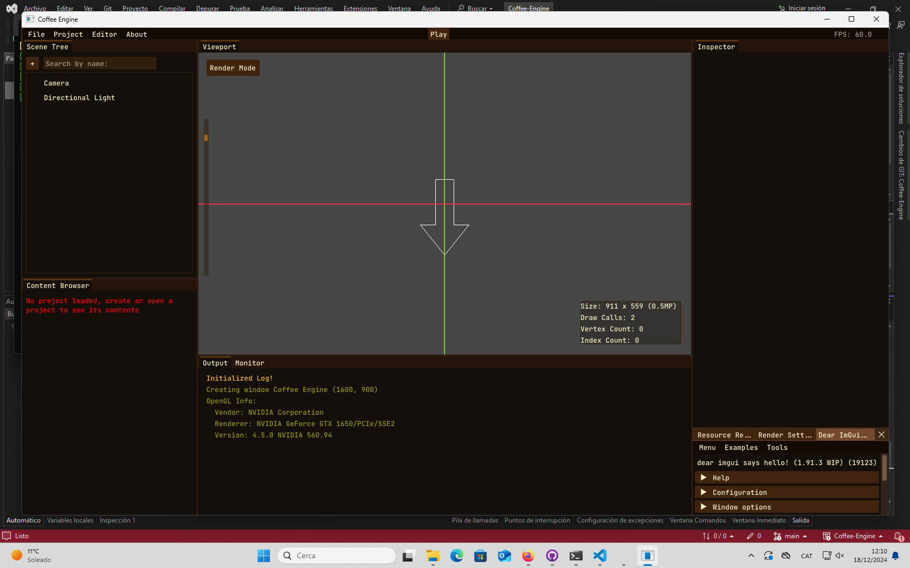

Visual Studio
=============

`Visual Studio Community <https://visualstudio.microsoft.com>`__ is a Windows-only IDE
by `Microsoft <https://microsoft.com>`_ that's free for individual use or non-commercial use within organizations.
It has many useful features, such as memory view, performance view, source
control and more.

Enable vcpkg:
-------------
If you have administrator permissions:
^^^^^^^^^^^^^^^^^^^^^^^^^^^^^^^^^^^^^^
    - https://devblogs.microsoft.com/cppblog/vcpkg-is-now-included-with-visual-studio/

If you don't have administrator permissions:
^^^^^^^^^^^^^^^^^^^^^^^^^^^^^^^^^^^^^^^^^^^^^^
    - Use the script (recommended option):
        > TODO
    - Manual installation:
    ```bash
        # Go to the user folder (optional)
        cd %UserProfile%

        # Clone vcpkg in a folder of your choice
        git clone https://github.com/microsoft/vcpkg.git

        # Bootstrap vcpkg
        cd vcpkg
        .\bootstrap-vcpkg.bat

        # Integrate this vcpkg instance into the system
        .\vcpkg.exe integrate install

        # Set the user environment variable
        setx VCPKG_ROOT .
    ```

Open the project:
-----------------
    - Two ways:
        - Right-click on the project folder and select **Open with Visual Studio**.
        - Open Visual Studio 2022 and use the **Open a Local Folder** option.

Once Visual Studio is opened:
-----------------------------
1. Ensure there are no errors and that **-- Running vcpkg install** appears in the output window.
    .. image:: img/Ventana-Salida-Correcto-Primera-Apertura.png
        :alt: Output window showing vcpkg install
2. Wait until you see **CMake generation has finished** in the output.
    .. image:: img/Ventana-Salida-Correcto-Esperar.png
        :alt: Output window showing CMake generation finished

Run the Engine:
---------------
1. Select the project to compile:
    .. image:: img/Seleccionar-Proyecto.png
        :alt: Selecting project to compile
2. Press the **Play** button:
    .. image:: img/Ejecutar.png
        :alt: Press the Play button to run the project

Hope nothing fails 0-o
----------------------

Enjoy!
------

